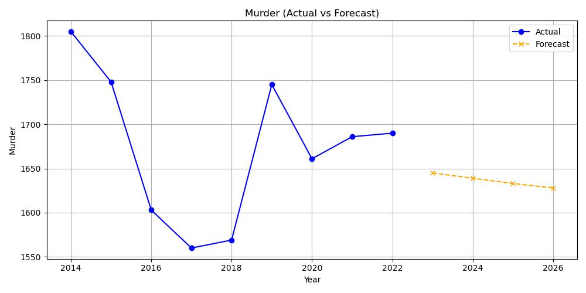
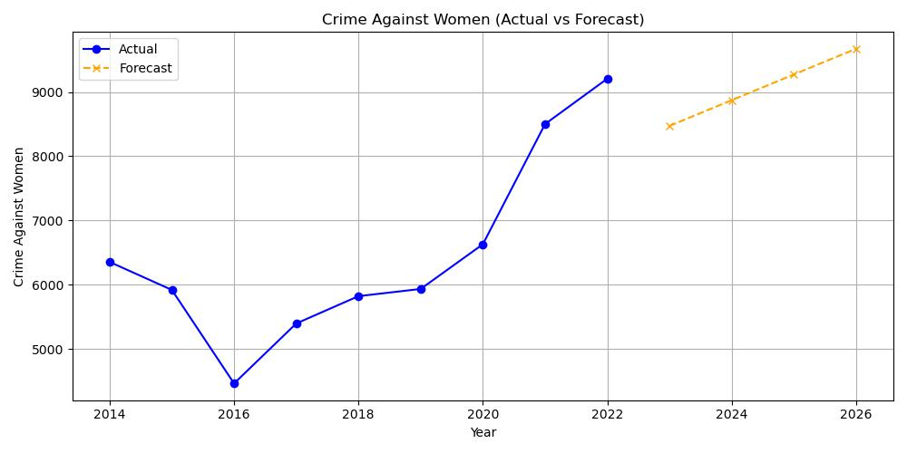

# 🔍 Crime Data Science Project – Tamil Nadu (2014–2026)

A full-stack data science project to analyze, visualize, and forecast crime trends in Tamil Nadu using real government crime records from 2014 to 2022, with machine learning predictions until 2026.

---

## 🎯 Project Objectives

- 🧹 Clean and preprocess Tamil Nadu crime data
- 📊 Perform in-depth Exploratory Data Analysis (EDA)
- 💡 Engineer features for meaningful crime categories
- 🔮 Forecast future crime rates (2023–2026) using machine learning
- 🔘 Cluster years based on crime patterns
- 🧪 Perform hypothesis testing on social crime factors
- 📈 Compare actual vs predicted crimes for key types
- 📝 Present findings with professional documentation and visuals

---

## 📁 Project Structure
crime-data-science-tamilnadu/
│
├── data/ # Raw data (2014–2022)
│ └── TN_Crime_Data_2014_to_2022.xlsx
├── notebooks/ # Jupyter Notebooks
│ └── crime_analysis.ipynb
├── output/ # All cleaned & generated files
│ ├── cleaned_data.csv
│ ├── full_crime_forecast_2023_2026.xlsx
│ ├── forecast_murder.png # Forecast visuals
│ └── ...
├── models/
│ └── crime_prediction_model.pkl
├── README.md
└── requirements.txt


---

## 🧰 Tools & Technologies

| Tool            | Purpose                             |
|-----------------|-------------------------------------|
| Python          | Main programming language           |
| Pandas          | Data handling and preprocessing     |
| Seaborn & Matplotlib | Data visualization              |
| Scikit-learn    | Regression & Clustering models      |
| SciPy           | Statistical testing                 |
| Jupyter Notebook| Experimentation and documentation   |
| VS Code         | Development environment             |

---

## 📊 Key Insights from EDA (2014–2022)

- 📈 Total IPC crimes showed a fluctuating trend with minor overall decline in recent years.
- 👩‍🦰 Crimes against women showed strong positive correlation (r ≈ 0.89) with total crime rates.
- 🧒 Crimes against children rose steadily from 2016 onward.
- 🧠 Technology-based crimes (cyber + economic) increased significantly from 2019 onward.

---

## 🔮 Forecast Summary (2023–2026)

Predicted using **Linear Regression** for each major crime type.

| Year | Total IPC Crimes | Tech/Economic Crimes | Foreign-Related Crimes |
|------|------------------|----------------------|------------------------|
| 2023 | 89,312           | 1,534                | 42                     |
| 2024 | 90,478           | 1,583                | 44                     |
| 2025 | 91,654           | 1,621                | 47                     |
| 2026 | 92,841           | 1,663                | 49                     |

> ✅ Full forecast for **14 major crime types** is available in `/output/full_crime_forecast_2023_2026.xlsx`.

---

## 🧪 Hypothesis Testing

Performed **Pearson correlation** to test statistical relationships:

- **Crimes Against Women vs Total IPC Crimes**  
  - Correlation: **0.89**
  - p-value: **< 0.01**
  - ✅ Conclusion: Statistically significant positive correlation

---

## 🔘 Clustering Results

Using **KMeans clustering**, grouped years into 3 crime-pattern clusters based on:

- Violent Crimes
- Vulnerable Group Crimes
- Tech-Economic Crimes

Result visualized to detect shift in patterns over time.

---

## 📈 Visual Examples

<p float="left">
  
  
</p>

---

## 🧾 How to Run This Project

1. Clone the repository:
   ```bash
   git clone https://github.com/yourusername/crime-data-science-tamilnadu.git
   cd crime-data-science-tamilnadu
   
2. Create a virtual environment (optional but recommended):
   ```bash
   python -m venv venv
   source venv/bin/activate  # On Windows: venv\Scripts\activate
   
3. Install dependencies:
   ```bash
   pip install -r requirements.txt
   
4. Open the notebook and run:
   ```bash
   jupyter notebook notebooks/crime_analysis.ipynb

---

## 📌 Credits
Data Source: Tamil Nadu Crime Statistics (NCRB Reports)

Author: Munusamy, Computer Science Graduate

Tools: Python, VS Code, Power BI (previous project phase)

---

## 📢 Contact & Portfolio
GitHub: https://github.com/Munusam

LinkedIn: https://www.linkedin.com/in/munusamy43/

Email: samy39018@gmail.com

---


